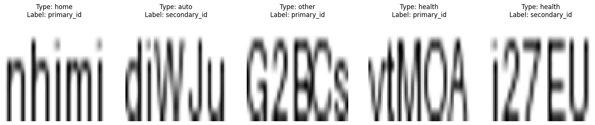
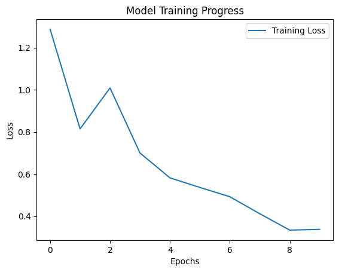

# 📄 DigiNsure: Automated Insurance Document Sorting


## 📖 Business Scenario
**DigiNsure Inc.** is an innovative insurance company focused on modernizing claims processing. Their latest initiative involves digitizing historical claim documents. The challenge is to automate the classification of scanned ID documents into **Primary** or **Secondary** categories based on the visual scan and the insurance context.

This project implements a **Multi-Modal Deep Learning Model** to solve this problem by fusing visual data (CNN) with structured metadata (categorical input).

## 🎯 Project Goals
* Build a custom Optical Character Recognition (OCR) pipeline using **PyTorch**.
* Process 64x64 pixel scanned document images.
* Integrate auxiliary data (Insurance Type) to improve classification accuracy.
* Train a model to distinguish between ID types.

## 📊 Data Visualization
The dataset consists of scanned ID snippets and their corresponding insurance types. Below is a sample output from our analysis:


*(Note: Images are pre-processed to 64x64 grayscale)*

## 🧠 Model Architecture
The model uses a dual-branch architecture that merges later in the network:

1.  **Visual Branch (CNN):**
    * Input: 64x64 Grayscale Image.
    * Layer: Conv2d (16 filters) → ReLU → MaxPool2d → Flatten.
    * Purpose: Extract visual features from the ID scan.
2.  **Metadata Branch (FCN):**
    * Input: One-Hot Encoded Insurance Type vector.
    * Layer: Linear → ReLU.
    * Purpose: Embed the context of the document.
3.  **Fusion & Classifier:**
    * Concatenates outputs from both branches.
    * Final Linear Layer maps to classification logits.



## 🛠 Installation & Usage

1.  **Clone the repository:**
    ```bash
    git clone [https://github.com/YOUR_USERNAME/ocr-multimodal-insurance.git](https://github.com/YOUR_USERNAME/ocr-multimodal-insurance.git)
    cd ocr-multimodal-insurance
    ```

2.  **Create and Activate Virtual Environment:**
    ```bash
    python -m venv venv
    # Windows:
    .\venv\Scripts\activate
    # Mac/Linux:
    source venv/bin/activate
    ```

3.  **Install dependencies:**
    ```bash
    pip install -r requirements.txt
    ```

4.  **Run the Analysis:**
    Open the Jupyter Notebook to see the training process:
    `notebooks/digital_insurance.ipynb`

## 🚀 Results
The model was trained for 10 epochs using `CrossEntropyLoss` and `Adam` optimizer, successfully converging and learning to distinguish between document types.